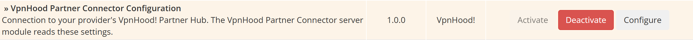
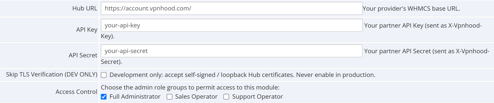
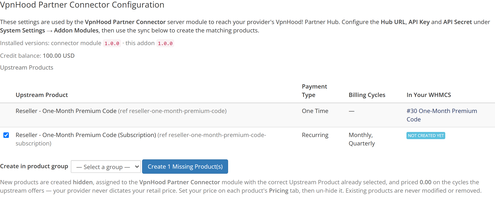
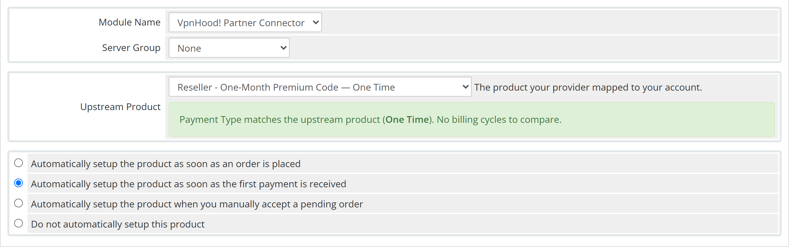

# VpnHood! Partner Connector (WHMCS)

[](https://github.com/vpnhood/VpnHood.WHMCS.Partner/releases/latest)

Resell **VpnHood** VPN keys from **your own WHMCS** at **your own prices**, without
running any VPN infrastructure and without writing any code.

When your customer buys a VPN product on your WHMCS, this module places an order on
your account with **VpnHood** (the **VpnHood! Partner Hub**), pays for it from your
**prepaid credit balance** there, receives the access key, and delivers it to your
customer — automatically.

```
Your customer ─▶ Your WHMCS (this module) ─▶ VpnHood! Partner Hub
                                             (paid from your prepaid credit)
```

You never run any VPN infrastructure and never handle VpnHood's payment — you simply
keep your prepaid credit topped up with VpnHood.

Want to go further than reselling — your own branded apps and in-app purchases on
Google Play and the App Store? See the **[White-Label Guide](docs/WHITE-LABEL.md)**.

## What you need from VpnHood

VpnHood will give you:

1. **Hub URL** – the address of the VpnHood! Partner Hub.
2. **API Key** and **API Secret** – your partner credentials.
3. One or more **products** mapped to your account — you pick these from a dropdown when
   setting up your own products (no need to copy any reference by hand).
4. A **prepaid credit balance** on your VpnHood account.

## Installation

1. Download **[vpnhoodpartner.zip](https://github.com/vpnhood/VpnHood.WHMCS.Partner/releases/latest/download/vpnhoodpartner.zip)**
   — always the latest release.
2. Upload the zip to the **root of your WHMCS installation** and extract it there. It contains a
   single `modules/` folder (`servers/vpnhoodpartner/` and `addons/vpnhoodpartnerconfig/`) that
   merges into your existing one.
3. **Delete the zip file** after extracting it.
4. In WHMCS Admin go to **System Settings → Addon Modules** and click **Activate** on
   **VpnHood Partner Connector Configuration**.

   

5. Click **Configure** and fill in:
   - **Hub URL**: already filled in with `https://account.vpnhood.com/`. Leave it as it is
     unless VpnHood gave you a different address.
   - **API Key**: your partner API Key.
   - **API Secret**: your partner API Secret.

   

   Leave **Skip TLS Verification** un-ticked — it is for development against a
   self-signed Hub and must never be enabled on a live store.

## Updating

Download the new zip and repeat steps 1–3. Extracting over the top replaces the module files and
leaves your settings, products and services untouched.

Then open **Addons → VpnHood Partner Connector Configuration** once. WHMCS applies any upgrade
the release needs on that page load, and the page reports the installed version of both halves —
if they disagree, the zip was only partly extracted and you should extract it again.

## Product setup

### The quick way: sync the products VpnHood offers you

Go to **Addons → VpnHood Partner Connector Configuration**. The page lists every product
VpnHood mapped to your account and shows which ones already exist in your WHMCS. Pick a
product group, click **Create Missing Product(s)**, and each missing one is created for you —
already assigned to the connector module with the right **Upstream Product** selected and the
same billing cycles the upstream product offers.



The page also shows your **credit balance** with VpnHood and the installed version of both
halves of the connector.

New products are created **hidden** and priced **0.00**, because only you decide your retail
price. For each one:

1. Set your price on the **Pricing** tab.
2. Un-tick **Hidden** on the **Details** tab so customers can order it.

The sync only ever **adds**. Products you already have are never modified, re-priced, or
removed, so it is safe to re-run whenever VpnHood offers you something new.

### Or create a product by hand

1. Go to **System Settings → Products/Services** and create a product at *your* price.
2. **Module Settings** tab:
   - **Module Name**: `VpnHood! Partner Connector` (`vpnhoodpartner`).
   - **Upstream Product**: pick from the dropdown — it lists exactly the products VpnHood
     mapped to your account (each label shows its available billing cycles).
3. Set your own pricing on the **Pricing** tab, matching the upstream product's cycle(s).
   If you enable a billing cycle the upstream product does not offer, the Module Settings
   tab shows a warning, and orders on that cycle are rejected at purchase time.



The green notice under **Upstream Product** is the compatibility check. It confirms your
product's Payment Type and billing cycles match the upstream product, and turns into a
warning when they do not — so you find out here rather than when a customer's order fails.

## How it works

| Event in your WHMCS | What the connector does upstream |
|---------------------|----------------------------------|
| Order placed / activated | `order` → provisions a key, returns the access code |
| Renewal | `renew` → keeps the upstream key's expiry in sync |
| Suspend | `suspend` → suspends the upstream key |
| Unsuspend | `unsuspend` → reactivates the upstream key |
| Terminate / Cancel | `terminate` → expires the upstream key |

The delivered access code is shown to your customer in their **client area** for the
service. Each key also carries VpnHood's own **order id** (`upstreamOrderId`, the handle
every lifecycle call sends) and **key id** (`accessTokenId`); both are shown on the
service's admin page under **Module Settings**. Those are the ids VpnHood recognises —
your own service and order ids mean nothing to them.

## Troubleshooting

- **"Connection to VpnHood Partner Hub failed"** – check the **Hub URL** in the addon
  configuration and that it is reachable over HTTPS.
- **"Invalid API credentials" / "suspended"** – verify your API Key/Secret and that your
  partner account is active with VpnHood.
- **"Insufficient credit"** – top up your prepaid balance with VpnHood.
- **"Order not found for this partner"** – the id sent as `upstreamOrderId` was not VpnHood's
  order id. Use the **VpnHood order id** shown on the service's admin page: never your own
  WHMCS service or order id, and never the number in a client-area URL — those are different
  sequences, and the same number is live upstream for another customer. When in doubt quote
  the **VpnHood key id** instead; it cannot collide.
- All errors are recorded under **Utilities → Logs → Module Log** (search `vpnhoodpartner`).

## License

LGPL-2.1 — see [LICENSE](LICENSE).
